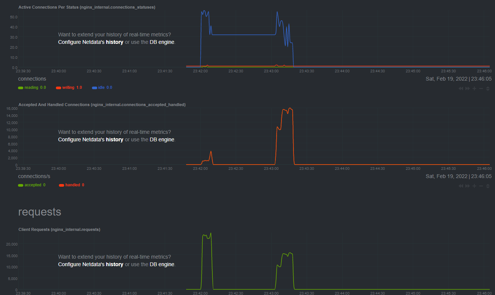
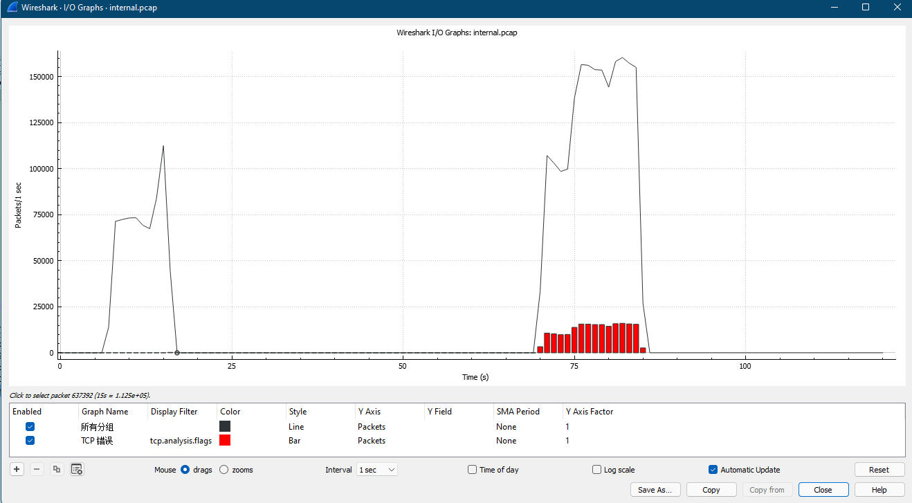

# nginx-benchmark

## run server

```bash
docker-compose up -d --build
```

## benchmark

监控 <http://192.168.2.201:19999>


```bash
docker exec -it internal-http-server bash

# ab 跑完后再停止抓包
tcpdump -w ihs.pcap

docker cp internal-http-server:/ihs.pcap ihs.pcap
```

[http1.1 and keeplive](ab-result/nginx11.log)
```bash
# 12:34:45 ~ 12:35:45
ab -c 100 -n 200000 -k http://192.168.2.201:60011/

Percentage of the requests served within a certain time (ms)
  50%     32
  66%     35
  75%     36
  80%     37
  90%     40
  95%     45
  98%     55
  99%     64
 100%    221 (longest request)
```

[http1.0 and close](ab-result/nginx10.log)
```bash
## 12:37:30 ~ 12:39:00
ab -c 100 -n 200000 -k http://192.168.2.201:60010/

Percentage of the requests served within a certain time (ms)
  50%     33
  66%     36
  75%     39
  80%     42
  90%     93
  95%    112
  98%    183
  99%    204
 100%   1055 (longest request)
```




# reference

<https://www.nginx.com/blog/tuning-nginx/>